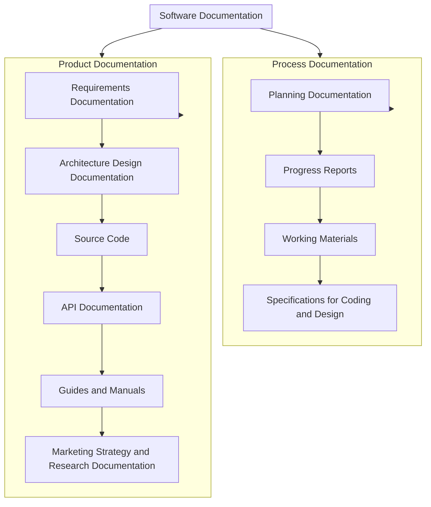

```mermaid
graph TB
  
  subgraph software[Software Documentation]
    direction TB
  end
  
  subgraph process[Process Documentation]
    direction TB
    planning[Planning Documentation]
    progress[Progress Reports]
    working[Working Materials]
    specs[Specifications for Coding and Design]
  end
  
  subgraph product[Product Documentation]
    direction TB
    reqs[Requirements Documentation]
    architecture[Architecture Design Documentation]
    src[Source Code]
    api[API Documentation]
    guides[Guides and Manuals]
    marketing[Marketing Strategy and Research Documentation]
  end

  software --> process --> planning --> progress --> working --> specs
  software --> product --> reqs --> architecture --> src --> api --> guides --> marketing
```

- [[Mermaid Diagrams]]
- [[Technical Documentation]]